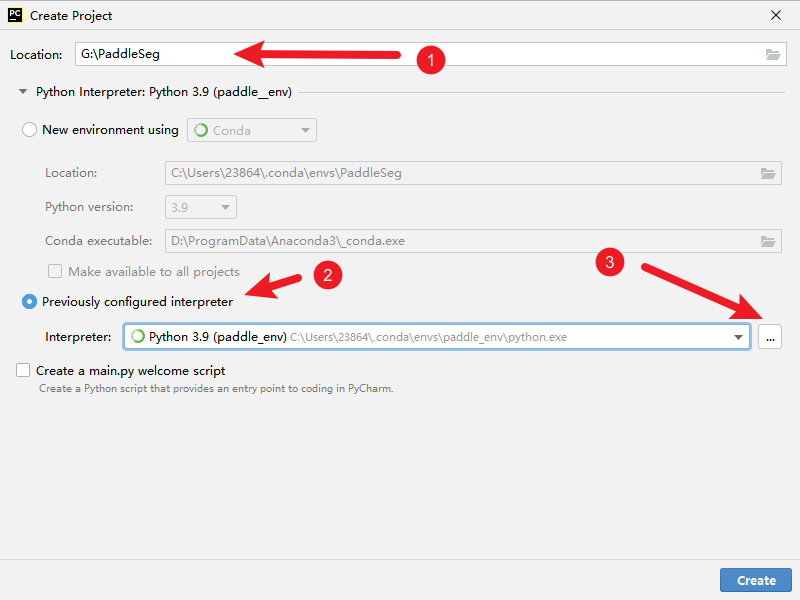
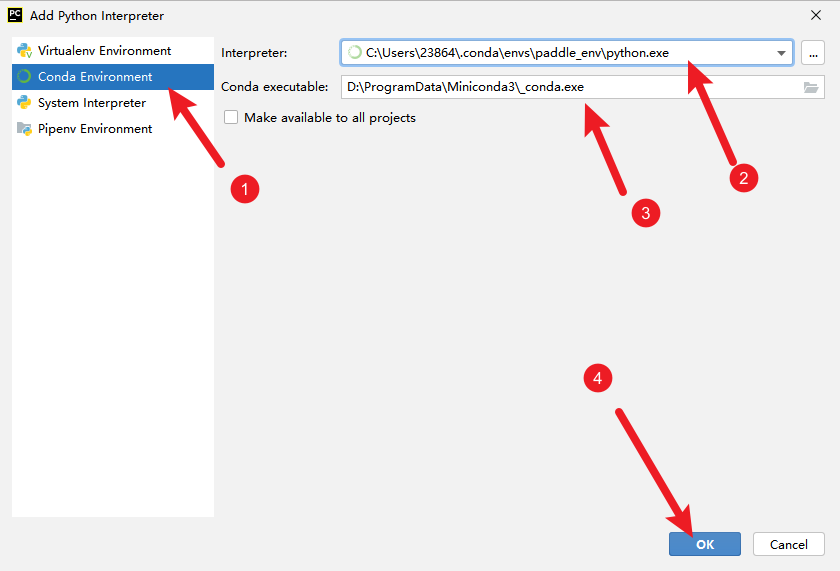

## Conada 安装配置 paddle_env

### 安装 miniconda


### 配置 paddle_env

参考 https://www.paddlepaddle.org.cn/documentation/docs/zh/install/conda/windows-conda.html#anchor-0 配置 paddle_env


### 下次进入激活 paddle_env

```powershell
conda activate paddle_env
G:
cd PaddleSeg
```


## pycharm 中打开 paddle_env





## 数据集处理

### 数据集合

现有数据集的目录结构为：

```
|-- data
	|-- mydata
		|-- d0 // 目录
		...
		|-- dn
	|-- alldata
```

先将 mydata 里面的 各个子目录的数据集合到 alldata 中，运行脚本 tools/gatherdata.py

```powershell
python .\tools\data\gather_alldata.py --input_dir .\data\mydata\ --output_dir .\data\alldata
```


### labelme 转换

参考：https://github.com/PaddlePaddle/PaddleSeg/blob/develop/docs/data/transform/transform_cn.md

如果没有安装 cv

```
pip install opencv-python scipy ml_collections
```

命令：

```
python tools/data/labelme2seg.py data/alldata
```


### 将数据集分为训练集和测试集

在 alldata 下新建 images 目录，并将 png 复制到 images 下。

```
mkdir data/alldata/images
cp data/alldata/*.png data/alldata/images/
```

使用 split_dataset_list.py 脚本分训练和测试

```
python .\tools\data\split_dataset_list.py .\data\alldata\ images annotations --format png png
```

alldata 目录下生成 train.txt, test.txt, val.txt 分别包含了训练测试评估的文件名

## 使用 RTFormer 进行训练

复制 configs/rtformer/rtformer_base_ade20k_512x512_160k.yml 复制到 config_ 目录下，修改其第一行为：

```yaml
_base_: 'mybase.yml'
```

在 config_ 目录中新建 mybase.yml，其内容参考 configs/\_base\_/ade20k.yml，并做相应修改

```yaml
batch_size: 4
iters: 80000

train_dataset:
  type: Dataset
  dataset_root: data/alldata
  train_path: data/alldata/train.txt
  num_classes: 3
  transforms:
    - type: ResizeStepScaling
      min_scale_factor: 0.5
      max_scale_factor: 2.0
      scale_step_size: 0.25
    - type: RandomPaddingCrop
      crop_size: [512, 512]
    - type: RandomHorizontalFlip
    - type: RandomDistort
      brightness_range: 0.4
      contrast_range: 0.4
      saturation_range: 0.4
    - type: Normalize
  mode: train

val_dataset:
  type: Dataset
  dataset_root: data/alldata
  val_path: data/alldata/val.txt
  num_classes: 3
  transforms:
    - type: Normalize
  mode: val


optimizer:
  type: sgd
  momentum: 0.9
  weight_decay: 4.0e-5

lr_scheduler:
  type: PolynomialDecay
  learning_rate: 0.01
  end_lr: 0
  power: 0.9

loss:
  types:
    - type: CrossEntropyLoss
  coef: [1]

```


### 开始训练

```
python train.py --config ./configs_/rtformer_base_ade20k_512x512_160k.yml --do_eval --use_vdl --save_interval 500 --save_dir output
```


### 评估

```
python val.py --config configs_/rtformer_base_ade20k_512x512_160k.yml --model_path output/best_model/model.pdparams
```


### 预测

```
python predict.py --config configs_/rtformer_base_ade20k_512x512_160k.yml --model_path output/best_model/model.pdparams --image_path data/alldata/images --save_dir data/alldata/predict_result --is_slide --crop_size 512 512
```

### 模型导出

#### 导出预测模型

参考：https://github.com/PaddlePaddle/PaddleSeg/blob/release/2.6/docs/model_export_cn.md

```
python export.py --config configs_/rtformer_base_ade20k_512x512_160k.yml --model_path output/best_model/model.pdparams --save_dir output --input_shape 1 3 512 512
```

如下是导出的预测模型文件。

```
output
  ├── deploy.yaml            # 部署相关的配置文件，主要说明数据预处理的方式
  ├── model.pdmodel          # 预测模型的拓扑结构文件
  ├── model.pdiparams        # 预测模型的权重文件
  └── model.pdiparams.info   # 参数额外信息，一般无需关注
```

#### 导出onnx 模型

参考：https://github.com/PaddlePaddle/PaddleSeg/blob/release/2.6/docs/model_export_onnx_cn.md

先安装 paddle2onnx

```
pip install paddle2onnx
```

导出 onnx

```
paddle2onnx  --model_dir output --model_filename model.pdmodel --params_filename model.pdiparams --save_file output.onnx --enable_dev_version True
```

转换失败：

```
[Paddle2ONNX] Start to parse PaddlePaddle model...
[Paddle2ONNX] Model file path: output\model.pdmodel
[Paddle2ONNX] Paramters file path: output\model.pdiparams
[Paddle2ONNX] Start to parsing Paddle model...
[Paddle2ONNX] Oops, there are some operators not supported yet, including max_pool2d_with_index,
[ERROR] Due to the unsupported operators, the conversion is aborted.
```

## 部署

由于导出 onnx 失败，看下怎么用 paddle 进行部署。

